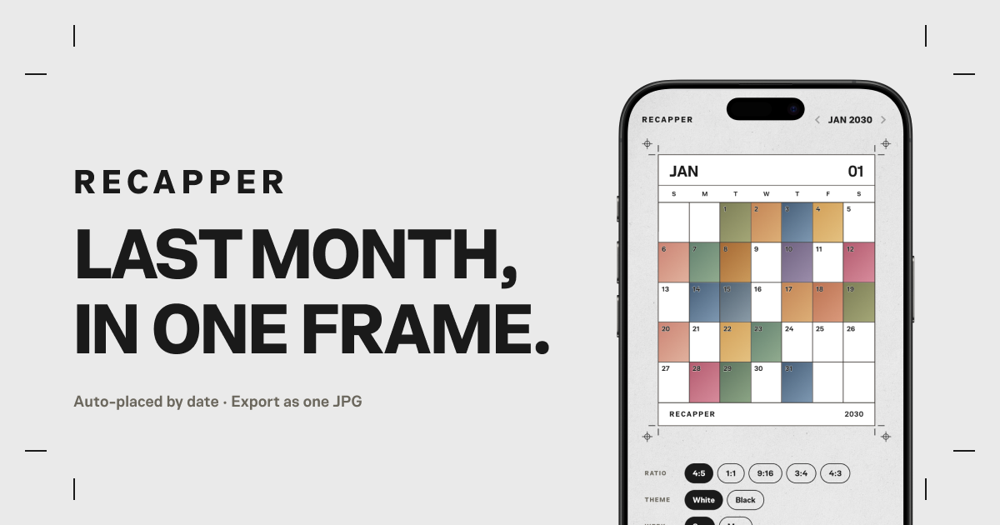

# Recapper

A free web tool to turn a month of photos into a single calendar frame and export as JPG  
지난 한 달의 사진을 캘린더 한 장으로 모아 JPG로 저장하는 무료 웹 도구

> **Last month, in one frame.**

---

## Who it's for / 이런 분께 유용해요

- Wrapping up a month of photos for Instagram or a journal  
  한 달 사진을 인스타그램·일기처럼 한 장으로 정리하고 싶을 때
- Looking back on a month visually — the date *is* the layout  
  날짜가 곧 레이아웃이 되는 방식으로 한 달을 돌아보고 싶을 때
- Making a clean photo recap without opening a design tool  
  디자인 도구 없이 깔끔한 사진 리캡을 만들고 싶을 때
- Keeping photos private — everything stays on your device  
  사진을 서버에 올리지 않고 기기 안에서만 처리하고 싶을 때

---

## Features / 주요 기능

|                                            |                                                                                  |
| ------------------------------------------ | -------------------------------------------------------------------------------- |
| 🗓️ **Auto-placement / 날짜 자동 배치**     | Dump photos — each lands on the right day by its EXIF date / EXIF 촬영일로 해당 날짜에 자동 배치 |
| 🃏 **Pick on conflict / 충돌 선택**        | Multiple photos on one day? Choose which one to keep / 한 날짜에 여러 장이면 한 장 선택        |
| ✋ **Reposition / 위치 조정**              | Drag inside a cell to reframe the crop / 칸 안에서 드래그해 사진 위치 조정                   |
| 📐 **Aspect ratios / 비율**               | 4:5 · 1:1 · 9:16 · 3:4 · 4:3 / 인스타 피드·스토리·가로형                            |
| 🎨 **Paper theme / 종이 테마**            | White or Black / 흰색·검정 종이 반전                                              |
| 📅 **Week start / 주 시작 요일**          | Sunday or Monday / 일요일·월요일 시작                                            |
| ➕ **Add more anytime / 사진 추가**        | Re-dump in bulk, or tap any empty day to place one / 벌크 재업로드 또는 빈 칸 탭으로 한 장씩 |
| 📤 **Export & share / 추출·공유**          | High-res JPG (long side 4096px), Web Share on mobile / 고해상도 JPG, 모바일은 공유 시트   |
| 🔒 **Fully local / 완전 로컬**            | No uploads — processed in your browser / 업로드 없이 브라우저에서만 처리 |

---

## How to use / 사용 방법

1. Dump your photos (PNG·JPG) — they're auto-placed by date  
   사진을 여러 장 올립니다 — 촬영일로 자동 배치됩니다
2. If a day has several photos, pick one in the conflict view  
   한 날짜에 여러 장이면 충돌 화면에서 한 장 고릅니다
3. Tap any day to add or edit; drag the preview to reposition  
   날짜 칸을 탭해 추가·편집하고, 프리뷰를 드래그해 위치를 맞춥니다
4. Choose ratio, theme, and week start  
   비율·테마·주 시작 요일을 고릅니다
5. Hit **Save · Share** to export the JPG  
   **Save · Share** 를 눌러 JPG로 내보냅니다

**No install · No sign-up · No watermark · Nothing leaves your device**  
설치 불필요 · 로그인 불필요 · 워터마크 없음 · 사진은 기기 밖으로 나가지 않음

> ⚠️ Photos and layout live in memory only — refreshing the page clears everything.  
> 사진과 배치는 메모리에만 있어 새로고침하면 사라집니다.
